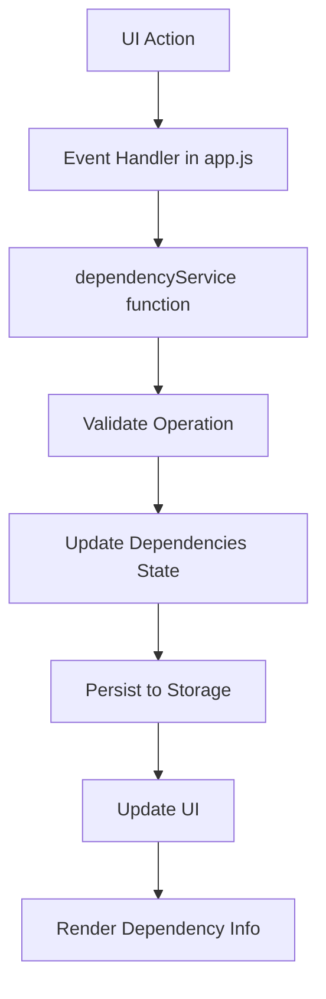

# Design Document: Task Dependencies and Relationships

## Overview

This design implements a task dependency system for Nautilus that allows users to define prerequisite relationships between tasks. The system maintains a directed acyclic graph (DAG) of task dependencies, validates against circular dependencies, and provides efficient querying of dependency relationships.

The implementation follows Nautilus's existing architectural patterns:
- Pure functional service layer with immutable data operations
- State management through module-scope variables in app.js
- Persistence via storage-client.js API
- Separation of business logic (services) from UI rendering

Key design decisions:
1. **Adjacency list representation**: Store dependencies as `{ taskId: [prerequisiteIds] }` for efficient lookups
2. **Eager validation**: Validate circular dependencies on every add operation to maintain graph integrity
3. **Automatic cleanup**: Remove dependencies when tasks are deleted to prevent orphaned references
4. **Dual indexing**: Maintain both forward (task → prerequisites) and reverse (task → dependents) indexes for efficient queries

## Architecture

### Component Structure

```
src/services/
  └── dependencyService.js    # Core dependency management logic
  
app.js                         # State management integration
storage-client.js              # Persistence (existing)
```

### Data Flow



### State Management

Dependencies will be stored in app.js module scope:
- `dependencies`: Object mapping taskId to array of prerequisite task IDs
- `dependencyCounter`: Not needed (dependencies identified by task ID pairs)

The dependency state will be persisted to storage with key `"dependencies"`.

## Components and Interfaces

### Dependency Service (dependencyService.js)

The dependency service provides pure functions for managing task dependencies. All functions follow the immutable pattern used in taskService.js and projectService.js.

#### Core Functions

```javascript
/**
 * Add a dependency relationship
 * @param {number} dependentTaskId - Task that depends on another
 * @param {number} prerequisiteTaskId - Task that must be completed first
 * @param {Object} dependencies - Current dependencies object
 * @param {Array} tasks - Current tasks array (for validation)
 * @returns {{dependencies: Object, error: string|null}}
 */
function addDependency(dependentTaskId, prerequisiteTaskId, dependencies, tasks)

/**
 * Remove a dependency relationship
 * @param {number} dependentTaskId - Task that depends on another
 * @param {number} prerequisiteTaskId - Task to remove as prerequisite
 * @param {Object} dependencies - Current dependencies object
 * @returns {{dependencies: Object}}
 */
function removeDependency(dependentTaskId, prerequisiteTaskId, dependencies)

/**
 * Get all prerequisite tasks for a given task
 * @param {number} taskId - Task to query
 * @param {Object} dependencies - Current dependencies object
 * @returns {Array<number>} Array of prerequisite task IDs
 */
function getPrerequisites(taskId, dependencies)

/**
 * Get all dependent tasks (tasks that depend on this task)
 * @param {number} taskId - Task to query
 * @param {Object} dependencies - Current dependencies object
 * @returns {Array<number>} Array of dependent task IDs
 */
function getDependents(taskId, dependencies)

/**
 * Check if a task is blocked (has incomplete prerequisites)
 * @param {number} taskId - Task to check
 * @param {Object} dependencies - Current dependencies object
 * @param {Array} tasks - Current tasks array
 * @returns {{blocked: boolean, blockingTasks: Array<Object>}}
 */
function isTaskBlocked(taskId, dependencies, tasks)

/**
 * Remove all dependencies involving a task (when task is deleted)
 * @param {number} taskId - Task being deleted
 * @param {Object} dependencies - Current dependencies object
 * @returns {{dependencies: Object}}
 */
function removeDependenciesForTask(taskId, dependencies)

/**
 * Validate that adding a dependency won't create a cycle
 * @param {number} dependentTaskId - Task that would depend on another
 * @param {number} prerequisiteTaskId - Task that would be prerequisite
 * @param {Object} dependencies - Current dependencies object
 * @returns {{valid: boolean, error: string|null, cycle: Array<number>|null}}
 */
function validateNoCycle(dependentTaskId, prerequisiteTaskId, dependencies)

/**
 * Serialize dependencies to JSON-compatible format
 * @param {Object} dependencies - Dependencies object
 * @returns {Object} JSON-serializable object
 */
function serializeDependencies(dependencies)

/**
 * Deserialize dependencies from storage format
 * @param {Object} data - Stored dependency data
 * @returns {Object} Dependencies object
 */
function deserializeDependencies(data)
```

### Integration Points

#### app.js State Management

Add to module-scope state:
```javascript
let dependencies = {}; // { taskId: [prerequisiteTaskIds] }
```

Add to appState bindings:
```javascript
dependencies: () => dependencies
```

#### Storage Keys

- `"dependencies"`: Main dependency graph storage

#### Task Deletion Integration

Modify the task deletion handler in app.js to call `removeDependenciesForTask`:

```javascript
// In deleteTask handler
const depResult = removeDependenciesForTask(taskId, dependencies);
dependencies = depResult.dependencies;
await saveData("dependencies", dependencies);
```

#### Bulk Operations Integration

Modify bulk delete operations to handle dependencies:

```javascript
// In bulk delete handler
selectedCards.forEach(taskId => {
    const depResult = removeDependenciesForTask(taskId, dependencies);
    dependencies = depResult.dependencies;
});
await saveData("dependencies", dependencies);
```

## Data Models

### Dependency Graph Structure

The dependency graph is stored as an adjacency list:

```javascript
{
  "5": [1, 2],      // Task 5 depends on tasks 1 and 2
  "7": [5],         // Task 7 depends on task 5
  "10": [3, 4, 5]   // Task 10 depends on tasks 3, 4, and 5
}
```

**Properties:**
- Keys are task IDs (as strings, since JSON object keys are strings)
- Values are arrays of prerequisite task IDs (as numbers)
- Empty arrays or missing keys indicate no prerequisites
- The structure is a directed acyclic graph (DAG)

### Reverse Index (Computed)

For efficient "get dependents" queries, we compute a reverse index on-demand:

```javascript
function buildReverseIndex(dependencies) {
    const reverse = {};
    for (const [dependentId, prerequisites] of Object.entries(dependencies)) {
        prerequisites.forEach(prereqId => {
            if (!reverse[prereqId]) {
                reverse[prereqId] = [];
            }
            reverse[prereqId].push(parseInt(dependentId, 10));
        });
    }
    return reverse;
}
```

### Task Model Extension

No changes to the task model itself. Dependency information is queried separately and displayed in the UI.

### Blocked Status Computation

A task is blocked if:
1. It has one or more prerequisite tasks, AND
2. At least one prerequisite task has status !== 'done'

```javascript
function isTaskBlocked(taskId, dependencies, tasks) {
    const prerequisites = getPrerequisites(taskId, dependencies);
    if (prerequisites.length === 0) {
        return { blocked: false, blockingTasks: [] };
    }
    
    const blockingTasks = prerequisites
        .map(prereqId => tasks.find(t => t.id === prereqId))
        .filter(task => task && task.status !== 'done');
    
    return {
        blocked: blockingTasks.length > 0,
        blockingTasks
    };
}
```

## Correctness Properties


*A property is a characteristic or behavior that should hold true across all valid executions of a system—essentially, a formal statement about what the system should do. Properties serve as the bridge between human-readable specifications and machine-verifiable correctness guarantees.*

### Property 1: Adding dependency creates the relationship

*For any* two valid task IDs (dependent and prerequisite), when a dependency is added and no cycle is created, the prerequisite should appear in the list of prerequisites for the dependent task.

**Validates: Requirements 1.1**

### Property 2: Invalid task IDs are rejected

*For any* task ID that does not exist in the tasks array, attempting to add a dependency involving that task should be rejected with an error.

**Validates: Requirements 1.2**

### Property 3: Circular dependencies are prevented

*For any* dependency graph and any pair of task IDs, if adding a dependency from task A to task B would create a cycle (including A depending on itself, or A→B→...→A), the operation should be rejected with an error describing the cycle.

**Validates: Requirements 1.3, 4.1, 4.2**

### Property 4: Multiple prerequisites allowed

*For any* task, adding multiple prerequisite tasks should result in all prerequisites being stored and retrievable.

**Validates: Requirements 1.6**

### Property 5: One task can be prerequisite for many

*For any* task used as a prerequisite for multiple dependent tasks, all dependent relationships should be maintained and queryable.

**Validates: Requirements 1.7**

### Property 6: Adding duplicate dependencies is idempotent

*For any* existing dependency relationship, attempting to add the same dependency again should not create duplicates or modify the dependency graph.

**Validates: Requirements 4.5**

### Property 7: Removing dependency deletes the relationship

*For any* existing dependency relationship, removing it should result in the prerequisite no longer appearing in the dependent task's prerequisite list.

**Validates: Requirements 2.1**

### Property 8: Removing one dependency preserves others

*For any* dependency graph with multiple relationships, removing one dependency should leave all other dependency relationships unchanged.

**Validates: Requirements 2.3**

### Property 9: Task deletion removes all related dependencies

*For any* task with dependencies (as either prerequisite or dependent), deleting that task should remove all dependency relationships involving it from the graph.

**Validates: Requirements 2.4, 8.1, 8.3**

### Property 10: Query returns correct prerequisites

*For any* task with prerequisites, querying its prerequisites should return exactly the set of task IDs that were added as prerequisites.

**Validates: Requirements 3.1**

### Property 11: Query returns correct dependents

*For any* task that is a prerequisite for other tasks, querying its dependents should return exactly the set of task IDs that depend on it.

**Validates: Requirements 3.2**

### Property 12: Blocked status computed correctly

*For any* task with prerequisites, the task should be marked as blocked if and only if at least one prerequisite task has status !== 'done', and should be unblocked when all prerequisites have status === 'done'.

**Validates: Requirements 6.1, 6.2**

### Property 13: Deleting prerequisite unblocks dependents

*For any* task that is blocked by a prerequisite, deleting that prerequisite task should result in the dependent task no longer being blocked by that specific prerequisite.

**Validates: Requirements 8.2**

### Property 14: Bulk deletion removes all related dependencies

*For any* set of tasks to be deleted, removing all of them should result in all dependency relationships involving any of those tasks being removed from the graph.

**Validates: Requirements 9.1**

### Property 15: Dependencies independent of project membership

*For any* dependency relationship, moving tasks between projects should preserve the dependency relationship unchanged.

**Validates: Requirements 9.2**

### Property 16: Serialization round-trip preserves graph

*For any* valid dependency graph, serializing then deserializing should produce an equivalent dependency graph with the same relationships.

**Validates: Requirements 10.2, 10.4**

### Property 17: Theme changes apply to all dependency UI elements

*For any* dependency UI element (indicator, blocked status, prerequisite list, dependent list), when the theme changes from light to dark or dark to light, all elements should immediately reflect the new theme's color scheme using CSS variables.

**Validates: Requirements 11.1, 11.2, 11.3**

## Dark Mode and Light Mode Support

## Error Handling

### Validation Errors

The dependency service returns structured error objects:

```javascript
{
    dependencies: Object,  // Updated or unchanged dependencies
    error: string | null   // Error message if operation failed
}
```

**Error Types:**

1. **Task Not Found**: "Task {id} does not exist"
2. **Circular Dependency**: "Adding this dependency would create a cycle: {taskIds}"
3. **Self Dependency**: "A task cannot depend on itself"
4. **Invalid Input**: "Invalid task ID: {id}"

### Graceful Degradation

- If dependency data is corrupted on load, initialize with empty dependencies object
- Log corruption errors to console for debugging
- Continue application operation with empty dependency state

### Edge Cases

1. **Empty dependency graph**: All operations should work with no existing dependencies
2. **Task with no dependencies**: Should return empty arrays for queries
3. **Orphaned dependencies**: Cleanup on task deletion prevents this
4. **Duplicate add attempts**: Idempotent - no error, no change

## Dark Mode and Light Mode Support

### Theme Integration

Nautilus uses CSS variables for theming. The dependency UI components will leverage existing theme variables and add new ones as needed for dependency-specific elements.

### CSS Variables for Dependencies

Add to the theme CSS files:

```css
/* Light mode (default) */
:root {
    --dependency-indicator-color: #6366f1;
    --dependency-blocked-color: #ef4444;
    --dependency-prerequisite-bg: #f0f9ff;
    --dependency-dependent-bg: #fef3c7;
    --dependency-link-color: #3b82f6;
    --dependency-link-hover: #2563eb;
}

/* Dark mode */
[data-theme="dark"] {
    --dependency-indicator-color: #818cf8;
    --dependency-blocked-color: #f87171;
    --dependency-prerequisite-bg: #1e3a5f;
    --dependency-dependent-bg: #422006;
    --dependency-link-color: #60a5fa;
    --dependency-link-hover: #93c5fd;
}
```

### UI Component Styling

All dependency-related UI elements will use CSS variables:

```css
.dependency-indicator {
    color: var(--dependency-indicator-color);
}

.blocked-indicator {
    color: var(--dependency-blocked-color);
    background-color: var(--dependency-blocked-bg);
}

.prerequisite-list {
    background-color: var(--dependency-prerequisite-bg);
}

.dependent-list {
    background-color: var(--dependency-dependent-bg);
}
```

### Theme Change Handling

No JavaScript changes needed - CSS variables automatically update when the `data-theme` attribute changes on the root element. Nautilus's existing theme toggle mechanism will handle this.

### Accessibility Considerations

- Ensure WCAG AA contrast ratios (4.5:1 for normal text, 3:1 for large text) in both themes
- Use both color and icons/text to indicate blocked status (not color alone)
- Test with browser developer tools to verify contrast ratios

## Testing Strategy

### Dual Testing Approach

This feature requires both unit tests and property-based tests for comprehensive coverage:

- **Unit tests**: Verify specific examples, edge cases, and error conditions
- **Property tests**: Verify universal properties across all inputs

Both testing approaches are complementary and necessary. Unit tests catch concrete bugs in specific scenarios, while property tests verify general correctness across a wide range of inputs.

### Property-Based Testing

We will use **fast-check** (JavaScript property-based testing library) to implement the correctness properties defined above.

**Configuration:**
- Minimum 100 iterations per property test
- Each test tagged with: `Feature: task-dependencies, Property {N}: {property description}`
- Each correctness property implemented as a SINGLE property-based test

**Test Structure:**

```javascript
import fc from 'fast-check';

// Feature: task-dependencies, Property 1: Adding dependency creates the relationship
test('Property 1: Adding dependency creates relationship', () => {
    fc.assert(
        fc.property(
            fc.array(fc.record({ id: fc.nat(), status: fc.constantFrom('todo', 'progress', 'done') })),
            fc.nat(),
            fc.nat(),
            (tasks, depId, prereqId) => {
                // Test implementation
            }
        ),
        { numRuns: 100 }
    );
});
```

### Unit Testing

Unit tests should focus on:

1. **Specific examples**: Concrete scenarios that demonstrate correct behavior
   - Adding a simple dependency (Task 2 depends on Task 1)
   - Removing a dependency
   - Querying dependencies for a task

2. **Edge cases**: Boundary conditions and special cases
   - Empty dependency graph
   - Task with no dependencies
   - Self-dependency rejection
   - Duplicate dependency handling

3. **Error conditions**: Specific error scenarios
   - Non-existent task IDs
   - Circular dependency detection (specific cycles like A→B→A)
   - Invalid input handling

4. **Integration points**: Service integration
   - Task deletion triggers dependency cleanup
   - Bulk operations handle dependencies correctly

**Balance**: Avoid writing too many unit tests for scenarios that property tests already cover. Focus unit tests on demonstrating clear examples and testing integration points.

### Test Coverage Goals

- All 16 correctness properties implemented as property-based tests
- Edge cases covered by unit tests
- Integration with task deletion tested
- Serialization/deserialization round-trip tested
- Error handling for all validation failures tested
